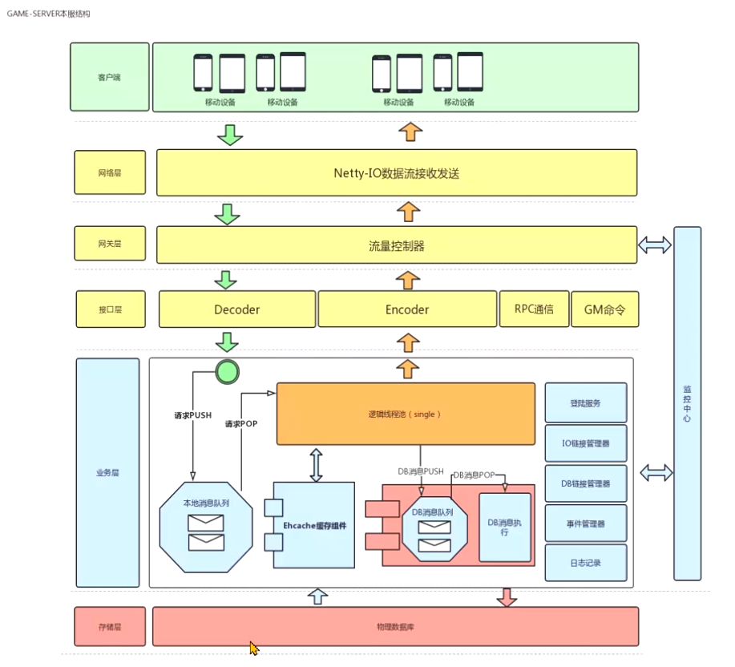
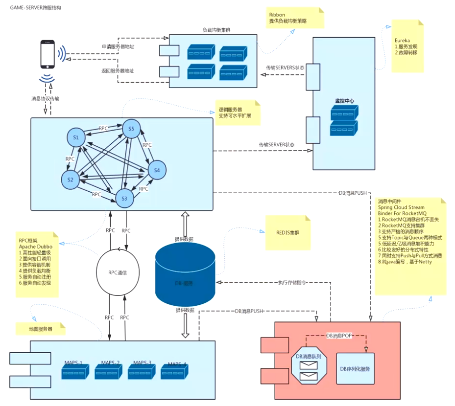
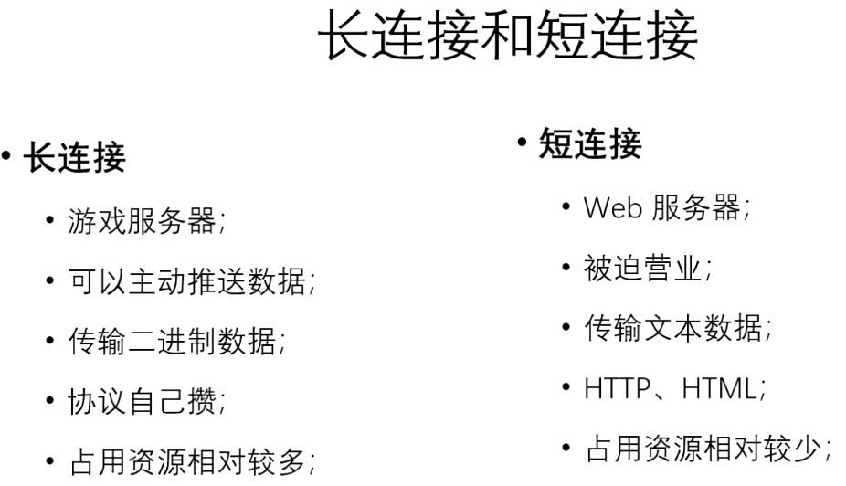
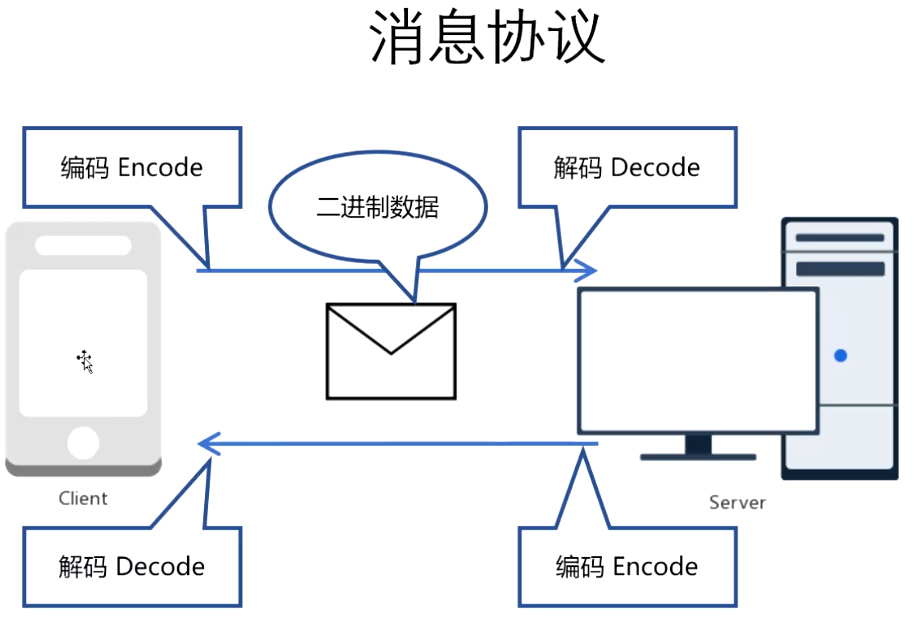
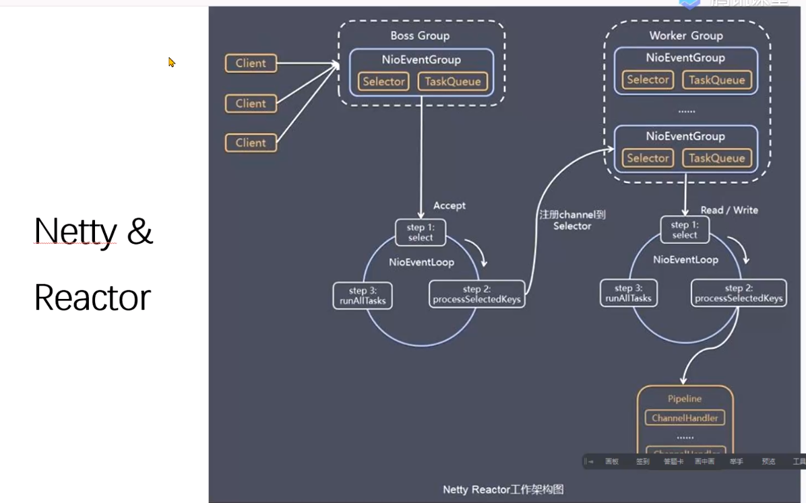

游戏服务器架构：大服架构和单服架构

web开发：产品经理，后端，前端h5，主程(游戏架构，复杂系统的框架实现)，运营，官托，策划(道具策划，剧情策划，数值策划)

IO多线程处理，数据合并写入数据库






查看游戏效果：http://cdn0001.afrxvk.cn/hero_story/demo/step030/index.html?r=0.8923972677009842

学习demo：http://cdn0001.afrxvk.cn/hero_story/demo/step010/index.html?serverAddr=127.0.0.1:12345&userId=1



游戏编码解码：使用二进制传输，体积小，传输效率高



新建项目:herostory

依赖: netty-all  4.1.43Final

```xml
<dependency>
 <groupId>io.netty</groupId>
  <artifactId>netty-all</artifactId>
  <version>4.1.43.Final</version>
</dependency>           
```



netty: reactor设计模型


