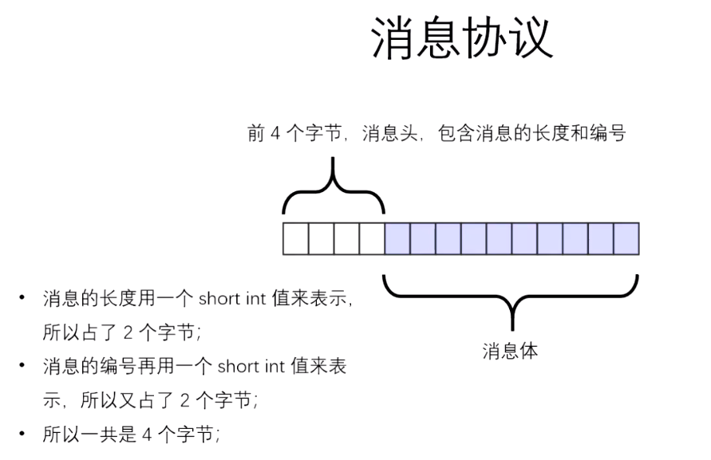
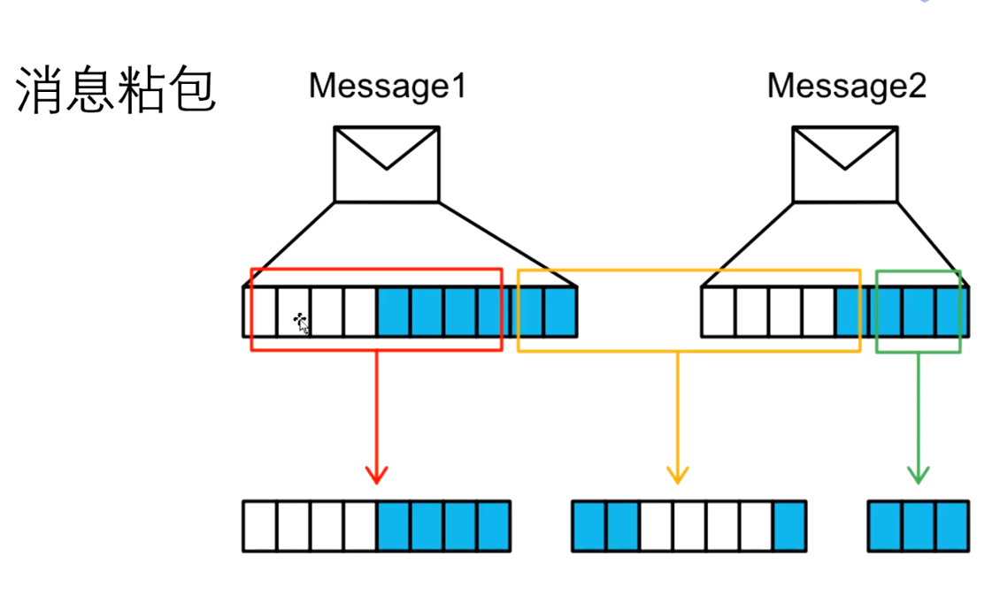
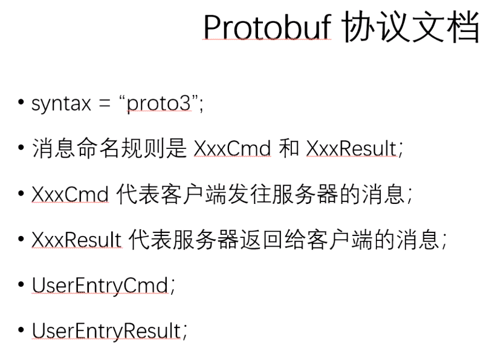
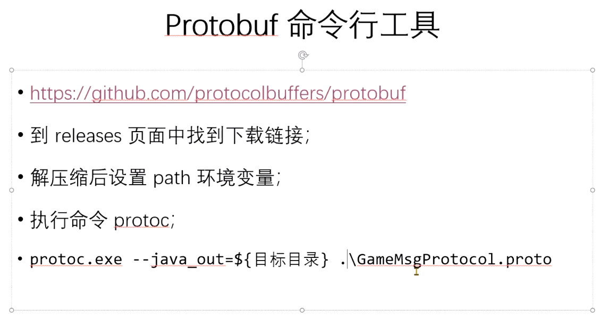
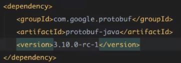
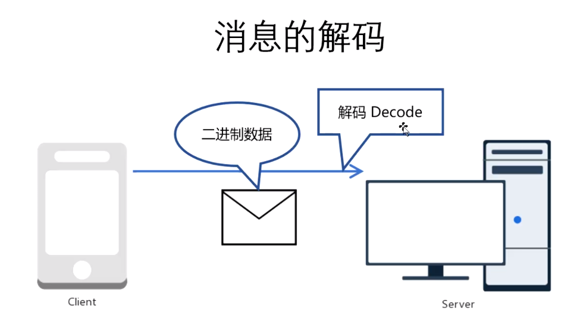
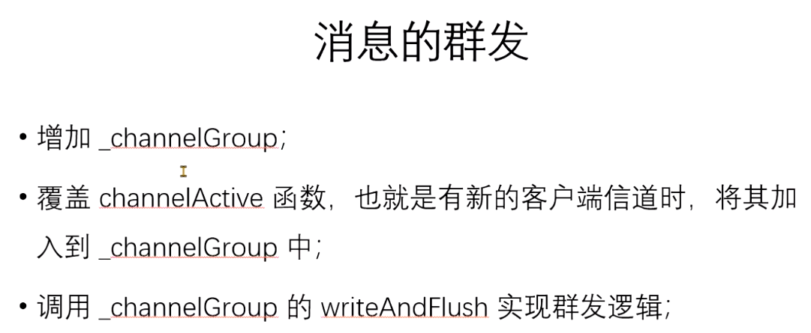
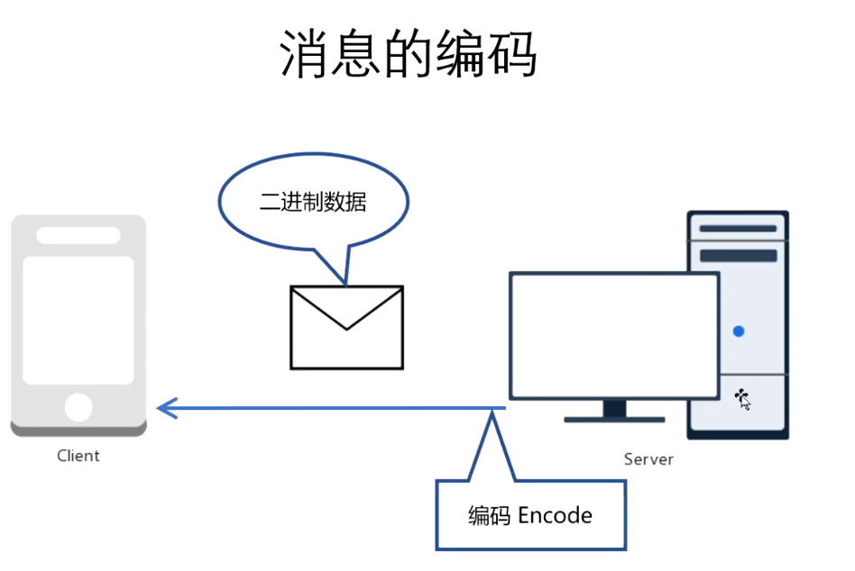

```
安装protoc安装包: protoc-3.11.1，配置环境变量
下载链接：https://github.com/hgq0916/protobuf
https://github.com/protocolbuffers/protobuf/releases
```



引入protobuf jar包



自定义消息解码器，并加入pipeline







处理消息：

> 1.用户入场消息
>
> 2.其他在场用户消息
>
> 3.用户移动消息
>
> 4.客户端离线处理

