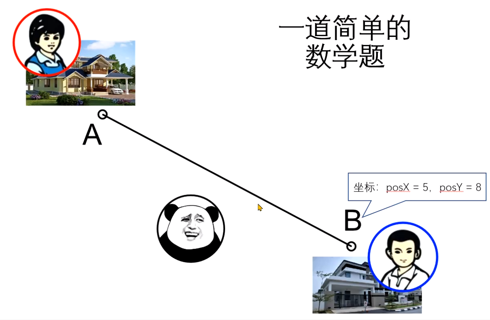
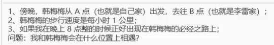
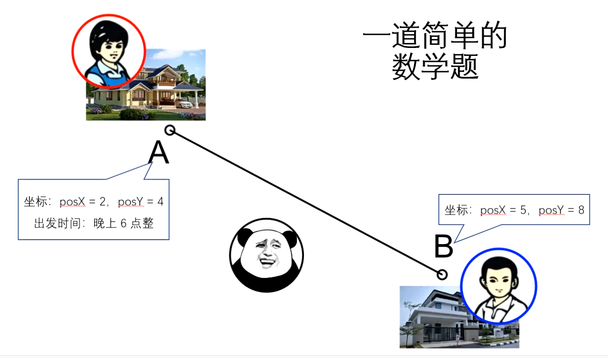
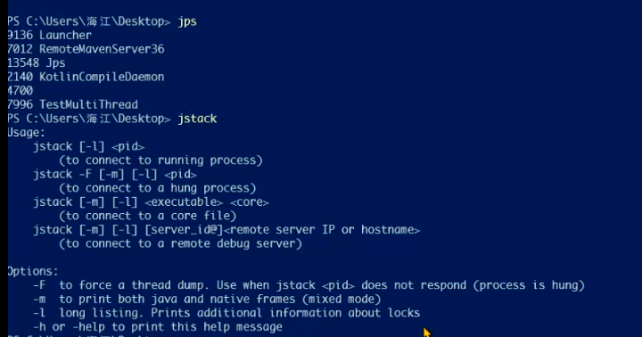
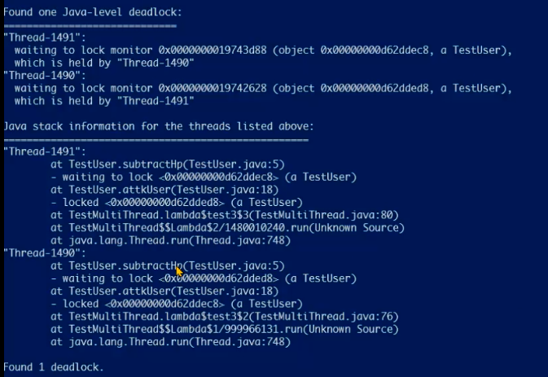
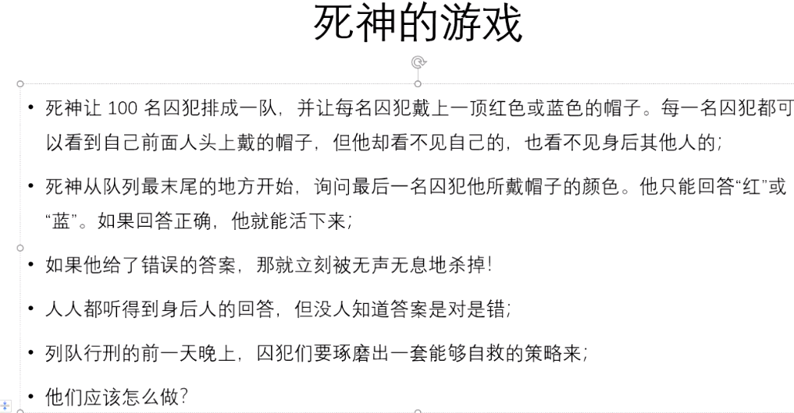
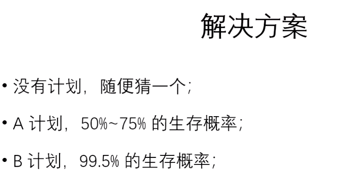
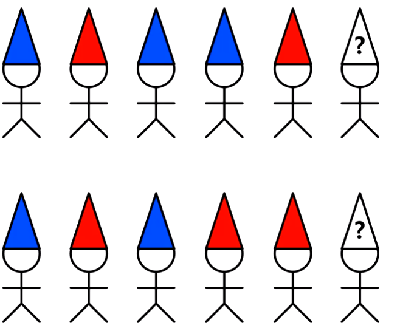
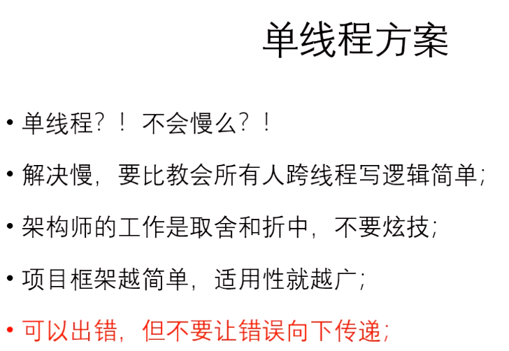

#### 重新设计移动消息

当前存在的问题：用户在移动过程中，另一个用户刷新了客户端，则刷新客户端的那个用户看不到之前的用户移动，原因是用户重进入场会发送哪些用户在场消息，但是并没有当前用户的位置信息。不仅要给用户的位置，还要能够表示用户移动的状态。








1.使用protoc构建新的移动消息

2.创建MoveState对象记录移动状态

3.修改其他用户在场消息，添加移动状态(出发点，目的点，启程时间)，前端根据移动状态计算用户现在的位置

```
#用户在场消息添加支持移动状态
http://cdn0001.afrxvk.cn/hero_story/demo/step020/index.html?serverAddr=127.0.0.1:12345&userId=1
```

存在问题：客户端时间可能有误差导致位置计算不准，解决方法是登录后和服务器同步时间，然后通过定时心跳和服务器同步时间

#### 用户攻击消息处理

1.用户入场：给用户初始化血量为100

2.用户攻击，广播减血量消息

3.用户血量为0，广播用户死亡消息

疑问：用户攻击太频繁会服务器压力很大，解决方法：用户攻击有冷却时间，前端控制，后端也会控制

双核4G服务器：能抗住3000个左右的socket连接

#### 多线程减血问题

volatile: 只能保证可见性，不能保证原子性

测试程序：两个用户互砍，多线程减血(sync,AtomicInteger)

查看死锁：
```
PS C:\Users\hugangquan0916\Desktop> jps
10352 Launcher
11776 JUnitStarter
6544 Launcher
11496
16648 Jps
8348 RemoteMavenServer

PS C:\Users\hugangquan0916\Desktop> jstack 11776

Found one Java-level deadlock:
=============================
"Thread-1":
  waiting to lock monitor 0x000000002099e768 (object 0x000000074159b648, a org.tinygame.herostory.User2),
  which is held by "Thread-0"
"Thread-0":
  waiting to lock monitor 0x000000002099e558 (object 0x000000074159b668, a org.tinygame.herostory.User2),
  which is held by "Thread-1"

Java stack information for the threads listed above:
===================================================
"Thread-1":
        at org.tinygame.herostory.User2.substractHp(User2.java:37)
        - waiting to lock <0x000000074159b648> (a org.tinygame.herostory.User2)
        at org.tinygame.herostory.User2.attkUser(User2.java:45)
        - locked <0x000000074159b668> (a org.tinygame.herostory.User2)
        at org.tinygame.herostory.MultiThreadTest.lambda$testThread4$1(MultiThreadTest.java:108)
        at org.tinygame.herostory.MultiThreadTest$$Lambda$2/991505714.run(Unknown Source)
        at java.lang.Thread.run(Thread.java:748)
"Thread-0":
        at org.tinygame.herostory.User2.substractHp(User2.java:37)
        - waiting to lock <0x000000074159b668> (a org.tinygame.herostory.User2)
        at org.tinygame.herostory.User2.attkUser(User2.java:45)
        - locked <0x000000074159b648> (a org.tinygame.herostory.User2)
        at org.tinygame.herostory.MultiThreadTest.lambda$testThread4$0(MultiThreadTest.java:105)
        at org.tinygame.herostory.MultiThreadTest$$Lambda$1/914504136.run(Unknown Source)
        at java.lang.Thread.run(Thread.java:748)

Found 1 deadlock.
```













A计划：偶数位置的人报奇数位置的人的帽子的颜色，然后偶数位置的人有25%的生存几率，奇数位置的人可以活下来，所以最终的生存概率是50%-75%

B计划：最后一个人发现前面所有人的红色帽子总数是奇数，报红色，否则报蓝色，假设最后一个人报红色，倒数第二个人发现红色帽子是偶数，则说明他自己是红色，然后倒数第二个人报红色，此时红色个数又变成偶数，倒数第三个人发现红色帽子是奇数，则说明他自己是红色，继续报红色，此时红色个数又变成奇数，倒数第四个人发现红色是奇数，则说明他自己是蓝色，依次类推。

书：<<谁是谷歌想要的人才>>



