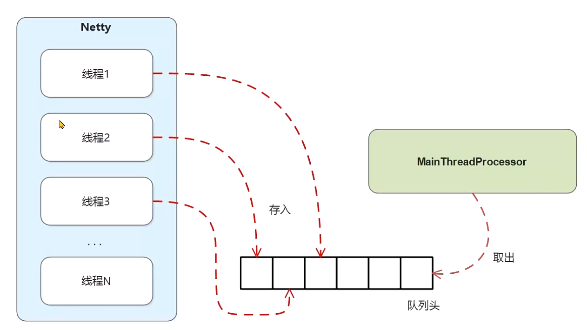
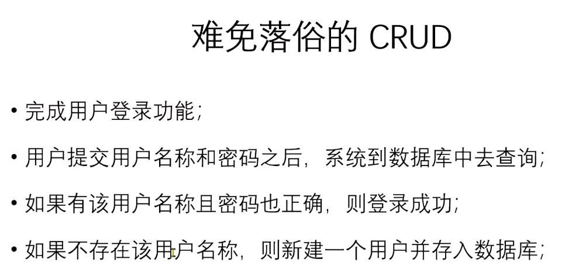
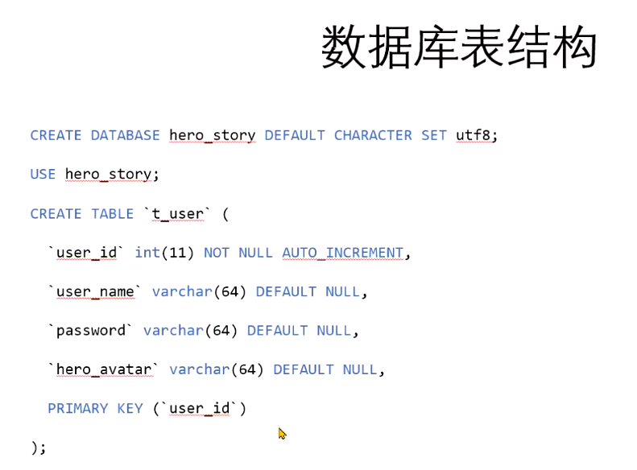

#### 单线程处理业务逻辑

好处是处理过程简单，如果用多线程要考虑并发加锁问题。

LinkedBlockingQueue: 链表阻塞队列，offer往队列添加，take获取，take方法是可以阻塞的

自定义线程池：MyExecutorService

业务高峰期：队列增加到最大值怎么处理？做限制，拒绝服务

生产者消费者模式：





#### 用户登录



添加依赖：mybatis，mysql驱动包

```xml
 <dependency>
 	<groupId>mysql</groupId>
  	<artifactId>mysql-connector-java</artifactId>
  	<version>8.0.19</version>
</dependency>      
<dependency>
    <groupId>org.mybatis</groupId>
    <artifactId>mybatis</artifactId>
    <version>3.5.2</version>
</dependency>
```

添加mybatis相关配置

```
```


添加用户登录处理器

创建Entity,Dao(根据用户名查询用户，新增用户)

