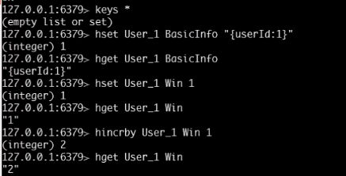
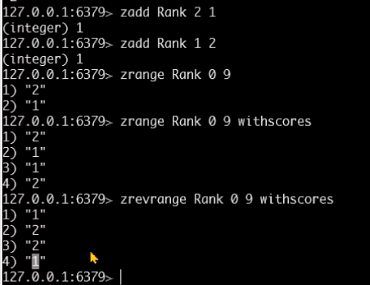
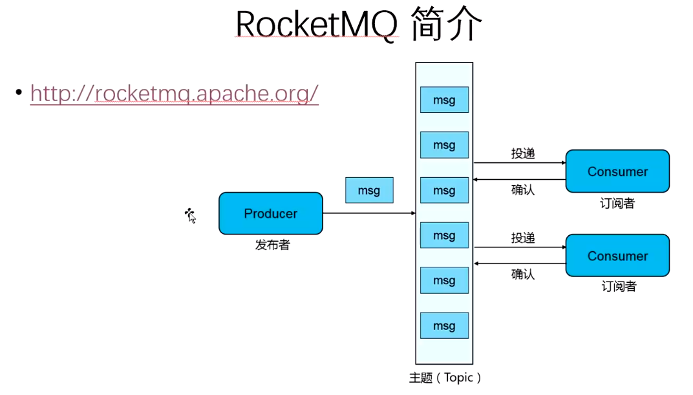
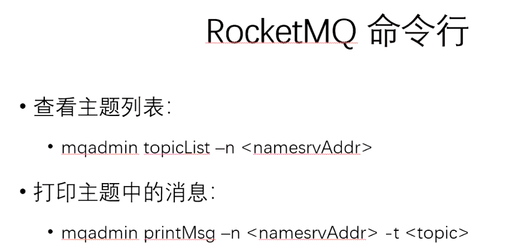
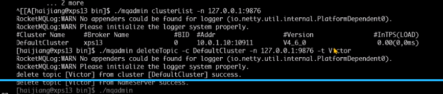
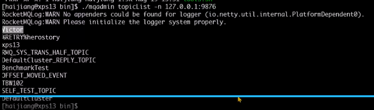

非功能需求：质量，约束，性能,需求中的衍生需求

书：《一线架构师实践指南》










```
#启动mq服务器
  > nohup sh bin/mqnamesrv &
  > tail -f ~/logs/rocketmqlogs/namesrv.log
  The Name Server boot success...
  
   > nohup sh bin/mqbroker -n localhost:9876 &
 > tail -f ~/logs/rocketmqlogs/broker.log 
  The broker[%s, 172.30.30.233:10911] boot success...
```




删除topic：./mqadmin deleteTopic  -n <namesrvAddr>  -t <topic>



查看消息：



