#### maven打tar.gz包

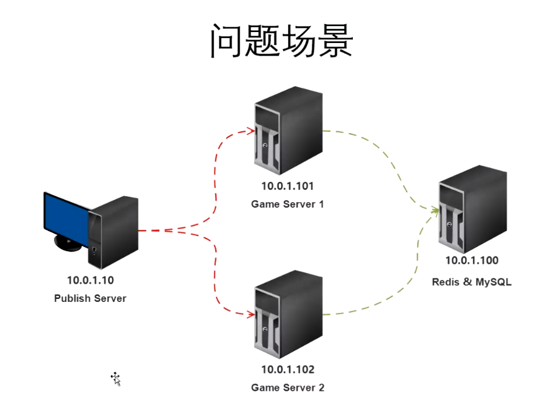  

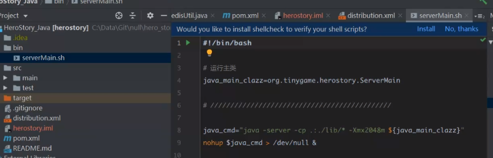

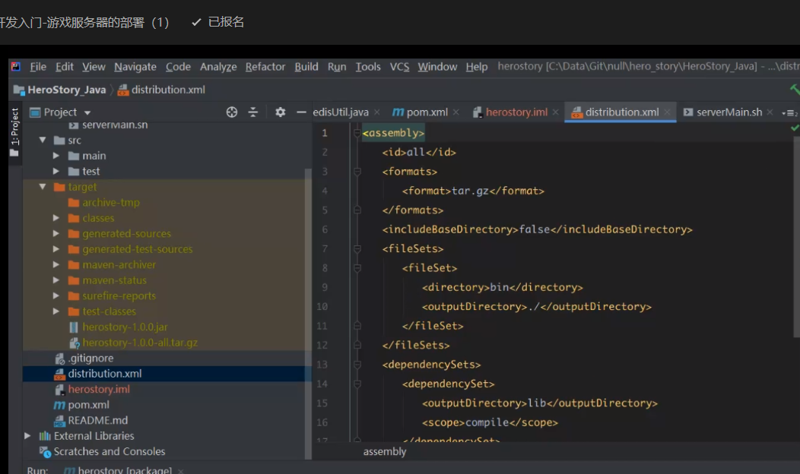

添加maven打包插件，打出tar.gz包

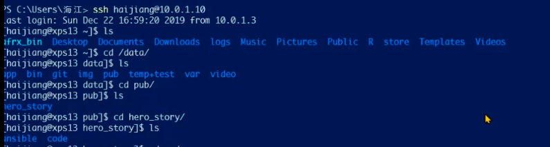

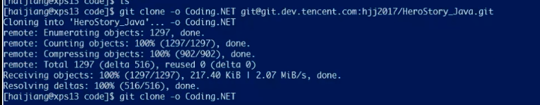


#### ansible部署并启动服务

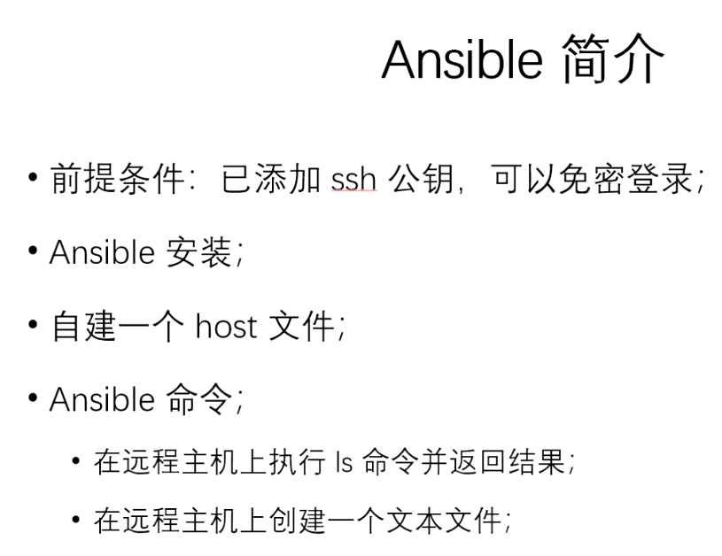

添加ssh公钥：

```
#在发布机器上生成ssh key
[root@localhost .ssh]# ssh-keygen -t rsa
wq #保存退出

#将公钥拷贝到目标机器上
[root@node01 .ssh]# ssh-copy-id -i id_128_rsa.pub root@192.168.25.60
root@192.168.25.60's password: 
Now try logging into the machine, with "ssh 'root@192.168.25.60'", and check in:
  .ssh/authorized_keys
to make sure we haven't added extra keys that you weren't expecting.

[root@node01 .ssh]# ssh-copy-id -i id_128_rsa.pub root@192.168.25.61
root@192.168.25.61's password: 
Now try logging into the machine, with "ssh 'root@192.168.25.61'", and check in:
  .ssh/authorized_keys
to make sure we haven't added extra keys that you weren't expecting.
```

在发布机器创建目录

```
[root@localhost ~]# mkdir /data/pub/herostory_source
[root@localhost ~]# mkdir /data/pub/herostory_source/code
[root@localhost ~]# mkdir /data/pub/herostory_source/ansible
```

git获取代码并使用mvn构建打包

```
[root@localhost code] git clone git://github.com/hgq0916/netty-herostory.git
[root@localhost code] cd netty_herostory
[root@localhost netty_herostory] mvn package
```

在ansible下添加host文件：

```
[root@localhost ansible]# vi host
[game_server_1]
192.168.25.60
[game_server_2]
192.168.25.61
```

```
[root@localhost ansible]# ansible -i host all -u root -a 'ls -al'
#往hosts配置的机器上写入临时文件hello.txt
[root@localhost ansible]# ansible -i host all -u root -m shell -a "cd /tmp; echo hello > hello.txt"
#往目标机器写入游戏安装包
[root@localhost ansible]# ansible -i host all -u root -m copy -a "src=/data/pub/herostory_source/code/netty-herostory/target/herostory-all.tar.gz dest=/tmp"
```

```
#写ansible批处理—— ansible-playbook
upload_tgz.yml
- hosts: all
  remote_user: root
  tasks:
    - name: 上传 tgz 包到服务器
      tags: upload_tgz
      copy: src="/data/pub/herostory_source/code/netty-herostory/target/herostory-all.tar.gz" dest="/data/game/hero_story"

    - name: 解压 tgz 包
      tags: tgz_x
      shell: |
        cd /data/game/hero_story
        tar -xzvf herostory-all.tar.gz
        chmod 755 serverMain.sh
        
#运行 ansible-playbook
ansible-playbook upload_tgz.yml -i host 

还可以增加参数，修改如下：
- hosts: {{ target_game_server }} # 这里使用参数方式
  remote_user: haijiang
  tasks:
    # ...
```

```
# 例 1：更新所有服务器
ansible-playbook upload_tgz.yml -i host -e "target_game_server=all"

# 例 2：只更新游戏服务器 1
ansible-playbook upload_tgz.yml -i host -e "target_game_server=game_server_1"

# 例 3：更新游戏服务器 1 和 2
ansible-playbook upload_tgz.yml -i host -e "target_game_server=game_server_1,game_server_2"
```

```
# 重启游戏服务器, restart_game_server.yml
- hosts: "{{ target_game_server }}"
  remote_user: root
  tasks:
    - name: 重启游戏服务器
      tags: restart_game_server
      shell: |
        killall java
        cd /data/game/hero_story
        sh ./serverMain.sh
```

```
#重启游戏服务器
ansible-playbook restart_game_server.yml -i host -e "target_game_server=all"

ansible-playbook restart_game_server.yml -i host -e "target_game_server=game_server_1"

ansible-playbook restart_game_server.yml -i host -e "target_game_server=game_server_2"

```


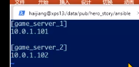

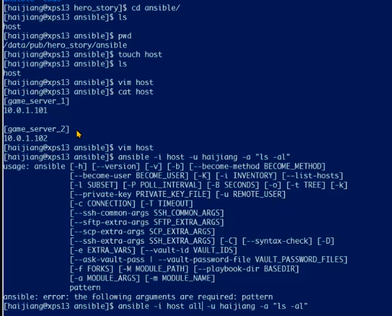


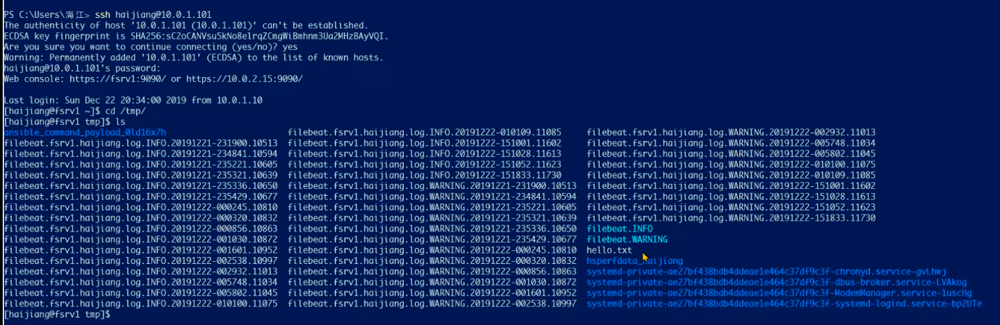

添加ssh公钥：

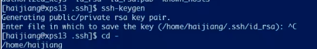

在源主机复制公钥，

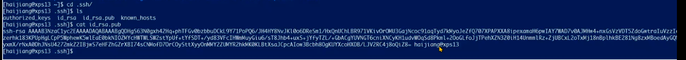

登录到目的主机，


编辑：vim authorized_keys，将公钥复制到这个文件中，就可以实现免密登录

```
history |grep ansible 查看之前输入过的命令
```


-m 表示要使用哪个模块，比如shell模块,需要到远程上执行shell命令

上传代码到目标服务器：

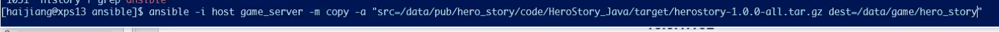

启用应用：


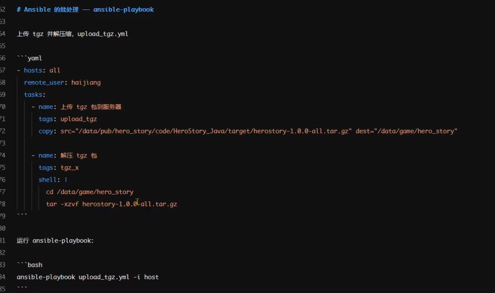

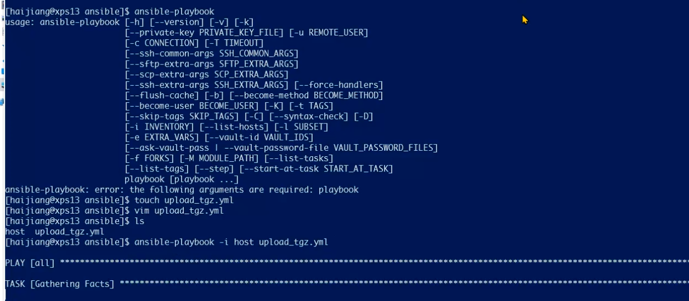

灰度发布：

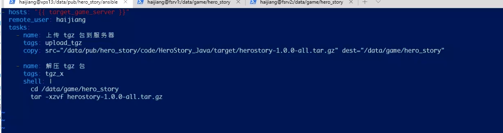

只更新game_server_1:

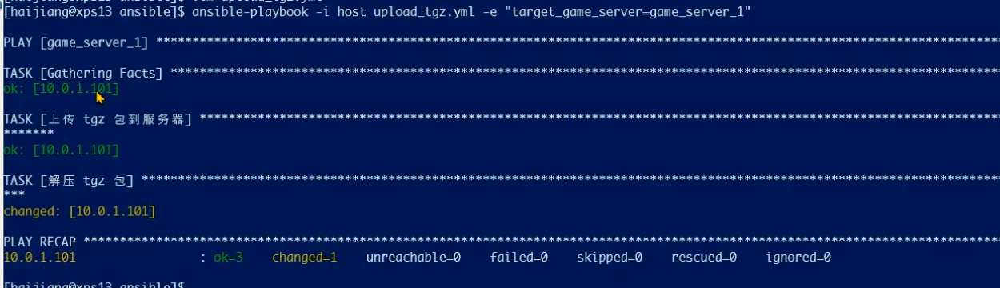

更新所有服务器:

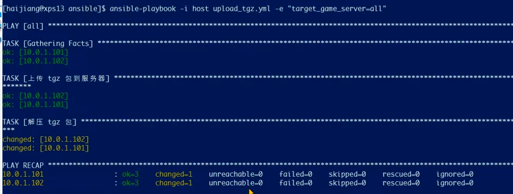

三个应用部署到两台物理机上，ansible会做合并处理，不会重传安装包

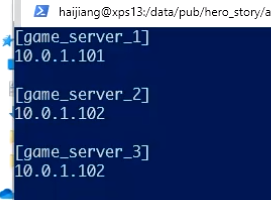

启动服务器：

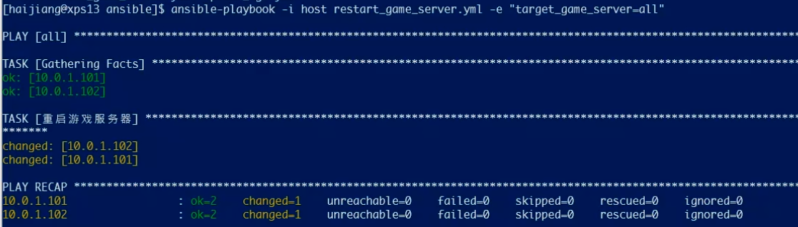

* 反射：如果一个方法是泛型参数，则通过反射可以获取到两个同名的方法，一个参数是原始类型，另一个参数是实际类型

#### jenkins 实现一键自动化部署启动

1.下载安装包(.war)：jenkins.io

2.使用tomcat运行Jenkins

3.安装jenkins

4.安装插件：**Extended Choice Parameter Plug-In**


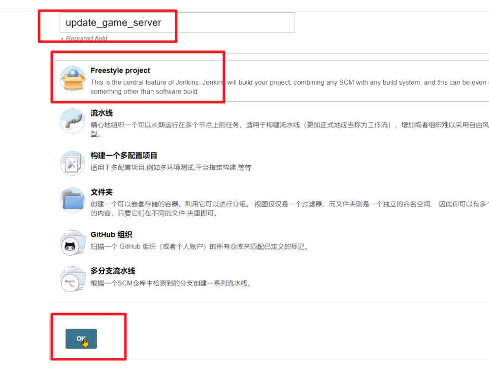

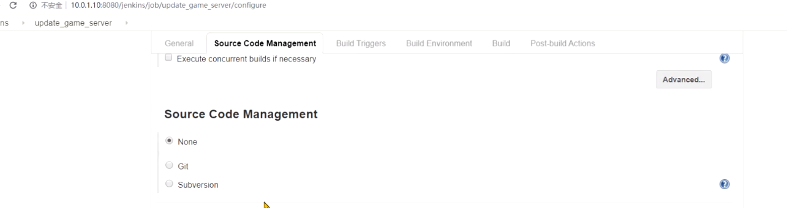

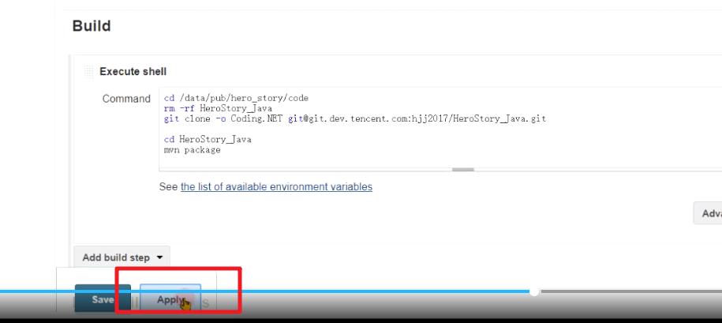

```
cd /data/pub/herostory_source/code
rm -rf netty-herostory
git clone git://github.com/hgq0916/netty-herostory.git
cd netty-herostory
mvn package
```


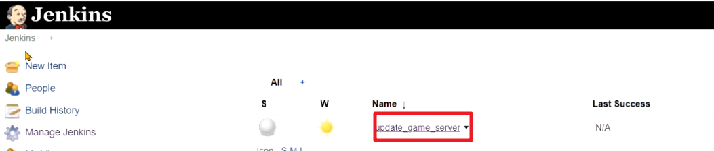

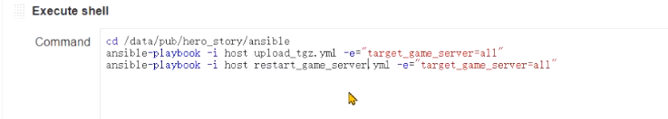

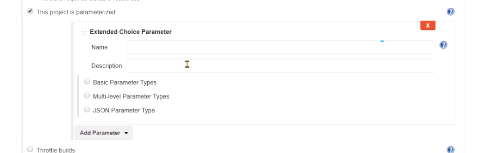

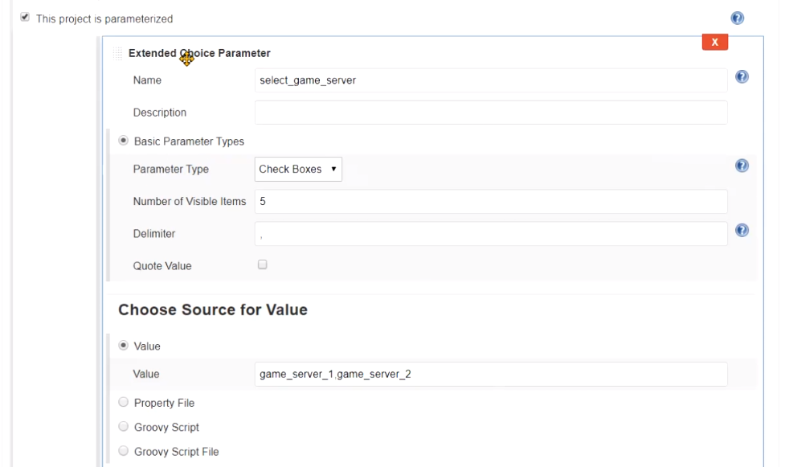

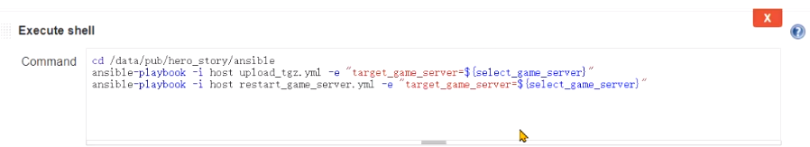

```
cd /data/pub/herostory_source/ansible
ansible-playbook upload_tgz.yml -i host -e "target_game_server=${select_game_server}"
ansible-playbook restart_game_server.yml -i host -e "target_game_server=${select_game_server}"
```


#### 跨服日志整合

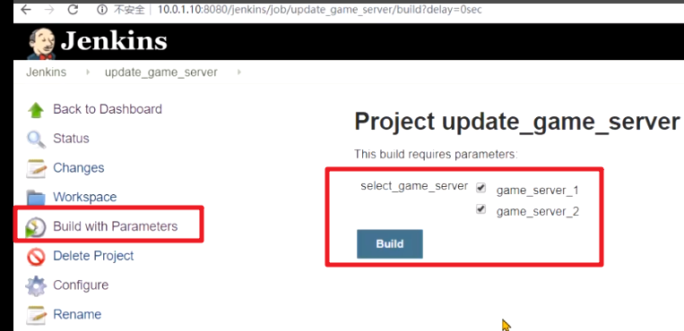

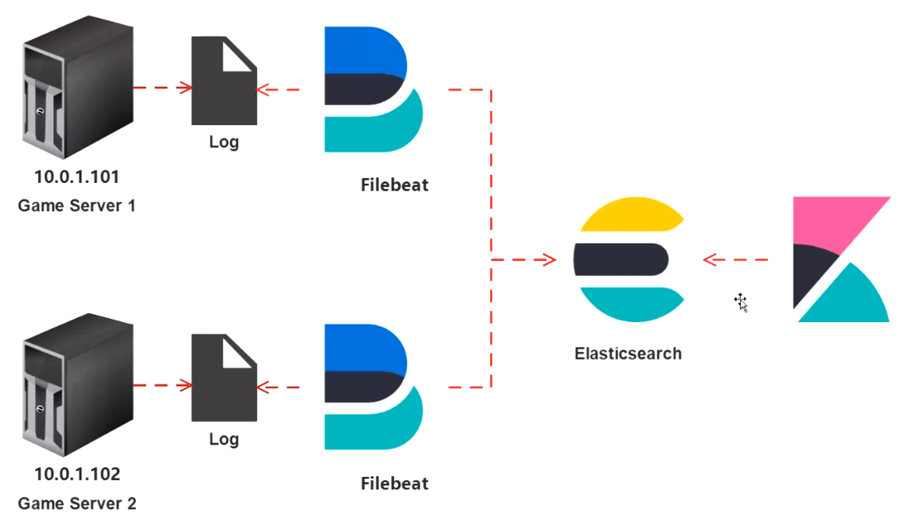

下载filebeat，kibana


安装并修改配置：

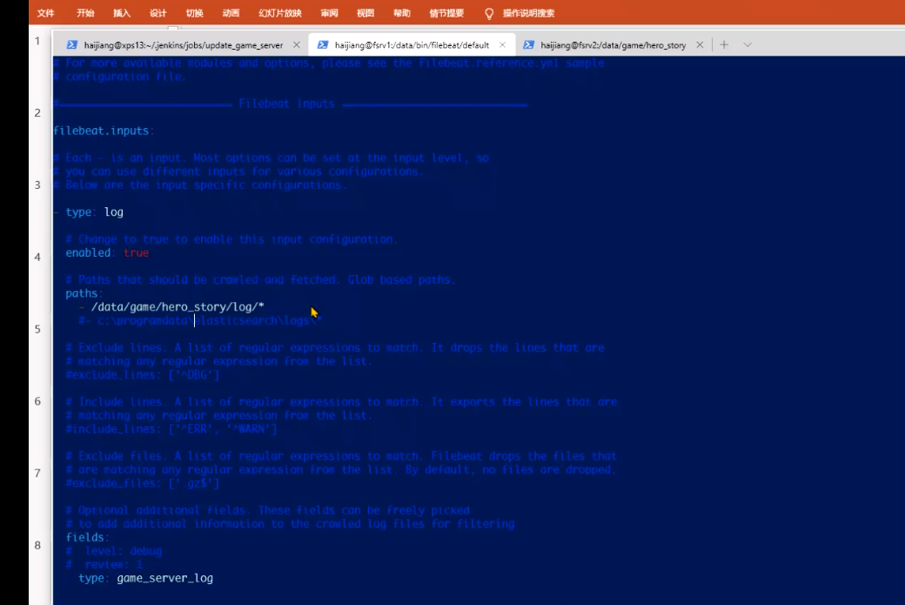

启动filebeat


 
